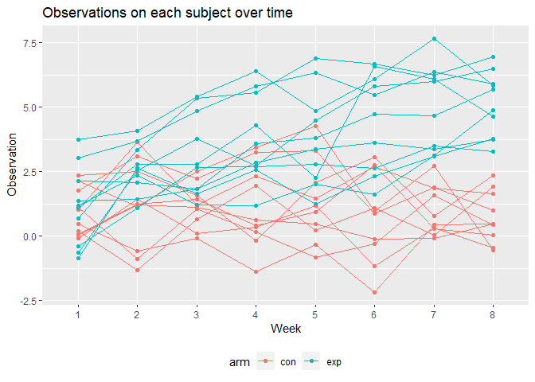

HW5
================

``` r
library(tidyverse)
```

    ## -- Attaching packages --------------------------------------- tidyverse 1.3.1 --

    ## v ggplot2 3.3.5     v purrr   0.3.4
    ## v tibble  3.1.4     v dplyr   1.0.7
    ## v tidyr   1.1.3     v stringr 1.4.0
    ## v readr   2.0.1     v forcats 0.5.1

    ## -- Conflicts ------------------------------------------ tidyverse_conflicts() --
    ## x dplyr::filter() masks stats::filter()
    ## x dplyr::lag()    masks stats::lag()

``` r
library(rvest)
```

    ## 
    ## 载入程辑包：'rvest'

    ## The following object is masked from 'package:readr':
    ## 
    ##     guess_encoding

``` r
library(data.table)
```

    ## 
    ## 载入程辑包：'data.table'

    ## The following objects are masked from 'package:dplyr':
    ## 
    ##     between, first, last

    ## The following object is masked from 'package:purrr':
    ## 
    ##     transpose

``` r
library(purrr)
```

## Problem 1

``` r
homicide_df = 
  read_csv("./homicide-data.csv", na = c("", "Unknown")) %>% #change " " and "unknown" to N/A
  mutate(city_state = str_c(city, state),
         resolution = case_when(
           disposition == "Closed without arrest" ~ "unsolved",
           disposition == "Open/No arrest" ~ "unsolved",
           disposition == "Closed by arrest" ~ "solved"
         )) %>% #combine city and state 2 col into 1 col #create a single outcome
  relocate(city_state) %>% 
  filter(city_state != "TulsaAL")
```

    ## Rows: 52179 Columns: 12

    ## -- Column specification --------------------------------------------------------
    ## Delimiter: ","
    ## chr (8): uid, victim_last, victim_first, victim_race, victim_sex, city, stat...
    ## dbl (4): reported_date, victim_age, lat, lon

    ## 
    ## i Use `spec()` to retrieve the full column specification for this data.
    ## i Specify the column types or set `show_col_types = FALSE` to quiet this message.

``` r
#put "homicide_df %>% count(disposition)" in console to get the number of different disposition
```

focus on Baltimore, MD.

``` r
baltimore_df = 
  homicide_df %>% 
  filter(city_state == "BaltimoreMD")

baltimore_summary = 
baltimore_df %>% 
  summarize(
    unsolved = sum(resolution == "unsolved"),
    n = n()
  )

baltimore_test = 
  prop.test(
  x = baltimore_summary %>% pull(unsolved),
  n = baltimore_summary %>% pull(n))

baltimore_test %>% 
  broom::tidy()#organize it as a data frame.
```

    ## # A tibble: 1 x 8
    ##   estimate statistic  p.value parameter conf.low conf.high method    alternative
    ##      <dbl>     <dbl>    <dbl>     <int>    <dbl>     <dbl> <chr>     <chr>      
    ## 1    0.646      239. 6.46e-54         1    0.628     0.663 1-sample~ two.sided

try to iterate across cities

first off, write a function and test it

``` r
prop_test_function = function(city_df){
  
  city_summary = 
    city_df %>% 
    summarize(
    unsolved = sum(resolution == "unsolved"),
    n = n()
  )
  
city_test = 
  prop.test(
    x = city_summary %>% pull(unsolved),
    n = city_summary %>% pull(n))

return(city_test)

}

prop_test_function(baltimore_df)
```

    ## 
    ##  1-sample proportions test with continuity correction
    ## 
    ## data:  city_summary %>% pull(unsolved) out of city_summary %>% pull(n), null probability 0.5
    ## X-squared = 239.01, df = 1, p-value < 2.2e-16
    ## alternative hypothesis: true p is not equal to 0.5
    ## 95 percent confidence interval:
    ##  0.6275625 0.6631599
    ## sample estimates:
    ##         p 
    ## 0.6455607

``` r
homicide_df %>% 
  filter(city_state == "AlbuquerqueNM") %>%
  prop_test_function()
```

    ## 
    ##  1-sample proportions test with continuity correction
    ## 
    ## data:  city_summary %>% pull(unsolved) out of city_summary %>% pull(n), null probability 0.5
    ## X-squared = 19.114, df = 1, p-value = 1.232e-05
    ## alternative hypothesis: true p is not equal to 0.5
    ## 95 percent confidence interval:
    ##  0.3372604 0.4375766
    ## sample estimates:
    ##         p 
    ## 0.3862434

let’s iterate across all cities.

``` r
results_df = 
  homicide_df %>% 
  nest(data = uid:resolution) %>% 
  mutate(
    test_results = map(data, prop_test_function),#run prop_test_function in each data list
    tidy_results = map(test_results, broom::tidy)
  ) %>% 
  select(city_state, tidy_results) %>% 
  unnest(tidy_results) %>% 
  select(city_state, estimate, starts_with("conf"))
```

try to make a plot showing estimates and ci

``` r
results_df %>% 
  mutate(city_state = fct_reorder(city_state, estimate)) %>% #keep it in a right order
  ggplot(aes(x = city_state, y = estimate)) +
  geom_point() +
  geom_errorbar(aes(ymin = conf.low, ymax = conf.high)) +
  theme(axis.text.x = element_text(angle = 90, vjust = 0.5, hjust = 1))
```

<!-- -->

``` r
homicide_df %>% 
  group_by(city_state) %>% 
  summarize(
    unsolved = sum(resolution == "unsolved"),
    n = n()
  ) %>% 
  mutate(
    test_results = map2(unsolved, n, prop.test),
    tidy_results = map(test_results, broom::tidy)
  ) %>% 
  select(city_state, tidy_results) %>% 
  unnest(tidy_results) %>% 
  select(city_state, estimate, starts_with("conf"))
```

    ## # A tibble: 50 x 4
    ##    city_state    estimate conf.low conf.high
    ##    <chr>            <dbl>    <dbl>     <dbl>
    ##  1 AlbuquerqueNM    0.386    0.337     0.438
    ##  2 AtlantaGA        0.383    0.353     0.415
    ##  3 BaltimoreMD      0.646    0.628     0.663
    ##  4 Baton RougeLA    0.462    0.414     0.511
    ##  5 BirminghamAL     0.434    0.399     0.469
    ##  6 BostonMA         0.505    0.465     0.545
    ##  7 BuffaloNY        0.612    0.569     0.654
    ##  8 CharlotteNC      0.300    0.266     0.336
    ##  9 ChicagoIL        0.736    0.724     0.747
    ## 10 CincinnatiOH     0.445    0.408     0.483
    ## # ... with 40 more rows

## Problem 2

``` r
longitudinal_df = 
  tibble(
  filename = list.files(path = "data", pattern = "*.csv", full.names = TRUE),
  df = map(.x = filename, ~read_csv(.x))
) %>% 
  separate(filename, into = c("file", "name"), sep = "/") %>% 
  separate(name, into = c("arm", "id", "csv")) %>% 
  select(-file, -csv) %>% 
  unnest(df) %>% 
  mutate(arm = as.factor(arm)) %>% 
  pivot_longer(
    week_1 : week_8,
    names_to = "time_week",
    names_prefix = "week_",
    values_to = "observations"
  )
longitudinal_df
```

    ## # A tibble: 160 x 4
    ##    arm   id    time_week observations
    ##    <fct> <chr> <chr>            <dbl>
    ##  1 con   01    1                 0.2 
    ##  2 con   01    2                -1.31
    ##  3 con   01    3                 0.66
    ##  4 con   01    4                 1.96
    ##  5 con   01    5                 0.23
    ##  6 con   01    6                 1.09
    ##  7 con   01    7                 0.05
    ##  8 con   01    8                 1.94
    ##  9 con   02    1                 1.13
    ## 10 con   02    2                -0.88
    ## # ... with 150 more rows

``` r
longitudinal_df %>% 
  mutate(fullname = str_c(arm, id, sep = "_")) %>% 
ggplot(aes(x = time_week, y = observations, color = arm)) +
  geom_point() +
  geom_line(aes(group = fullname)) +
  labs(title = "Observations on each subject over time")
```

<!-- -->

**From the spaghetti plot we can learn that participants in control
group have steady observations while participants in experimental group
have increasing observations. According to this, we can initially guess
that the experimental arm will lead to a higher obsevation.**

## Problem 3

``` r
set.seed(10)

iris_with_missing = iris %>% 
  map_df(~replace(.x, sample(1:150, 20), NA)) %>%
  mutate(Species = as.character(Species)) 
```

Fill in missing values with the mean of non-missing values For character
variables, fill in missing values with `virginica`

``` r
iris_na = function(x) {
  if (is.numeric(x)){
    x[is.na(x)] = round(mean(x,na.rm = T))
  return(x)
  }
  if (is.character(x)) {
    x[is.na(x)] = "virginica"
    return(x)
  }}
iris_df = map_df(iris_with_missing, iris_na)
iris_df
```

    ## # A tibble: 150 x 5
    ##    Sepal.Length Sepal.Width Petal.Length Petal.Width Species
    ##           <dbl>       <dbl>        <dbl>       <dbl> <chr>  
    ##  1          5.1         3.5          1.4         0.2 setosa 
    ##  2          4.9         3            1.4         0.2 setosa 
    ##  3          4.7         3.2          1.3         0.2 setosa 
    ##  4          4.6         3.1          1.5         1   setosa 
    ##  5          5           3.6          1.4         0.2 setosa 
    ##  6          5.4         3.9          1.7         0.4 setosa 
    ##  7          6           3.4          1.4         0.3 setosa 
    ##  8          5           3.4          1.5         0.2 setosa 
    ##  9          4.4         2.9          1.4         0.2 setosa 
    ## 10          4.9         3.1          4           0.1 setosa 
    ## # ... with 140 more rows
