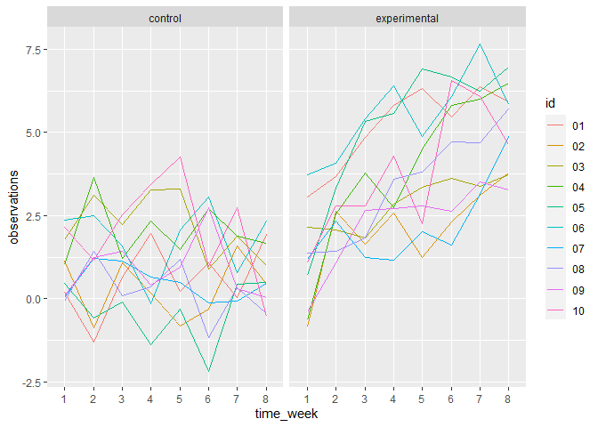

HW5
================

``` r
library(tidyverse)
```

    ## -- Attaching packages --------------------------------------- tidyverse 1.3.1 --

    ## v ggplot2 3.3.5     v purrr   0.3.4
    ## v tibble  3.1.4     v dplyr   1.0.7
    ## v tidyr   1.1.3     v stringr 1.4.0
    ## v readr   2.0.1     v forcats 0.5.1

    ## -- Conflicts ------------------------------------------ tidyverse_conflicts() --
    ## x dplyr::filter() masks stats::filter()
    ## x dplyr::lag()    masks stats::lag()

``` r
library(rvest)
```

    ## 
    ## 载入程辑包：'rvest'

    ## The following object is masked from 'package:readr':
    ## 
    ##     guess_encoding

``` r
library(data.table)
```

    ## 
    ## 载入程辑包：'data.table'

    ## The following objects are masked from 'package:dplyr':
    ## 
    ##     between, first, last

    ## The following object is masked from 'package:purrr':
    ## 
    ##     transpose

``` r
library(purrr)
```

## Problem 2

``` r
dir = "./data"
file_list = list.files(path = dir, pattern = "*.csv$", full.names = TRUE, recursive = TRUE)
longitudinal_df = map_df(file_list, read_csv, id = "input") %>% 
  mutate(participant = recode(input, './data/con_01.csv' = "con_01", './data/con_02.csv' = "con_02", './data/con_03.csv' = "con_03", './data/con_04.csv' = "con_04", './data/con_05.csv' = "con_05", './data/con_06.csv' = "con_06", './data/con_07.csv' = "con_07", './data/con_08.csv' = "con_08", './data/con_09.csv' = "con_09", './data/con_10.csv' = "con_10", './data/exp_01.csv' = "exp_01", './data/exp_02.csv' = "exp_02", './data/exp_03.csv' = "exp_03", './data/exp_04.csv' = "exp_04", './data/exp_05.csv' = "exp_05", './data/exp_06.csv' = "exp_06", './data/exp_07.csv' = "exp_07", './data/exp_08.csv' = "exp_08", './data/exp_09.csv' = "exp_09", './data/exp_10.csv' = "exp_10")) %>% 
  select(-input) %>% 
  select(participant, everything()) %>%
  separate(participant, into = c("arm", "id"), sep = "\\_") %>% 
  mutate(arm = recode(arm, 'con' = "control", 'exp' = "experimental")) %>%
  pivot_longer(
    week_1 : week_8,
    names_to = "time_week",
    names_prefix = "week_",
    values_to = "observations"
  )
longitudinal_df
```

    ## # A tibble: 160 x 4
    ##    arm     id    time_week observations
    ##    <chr>   <chr> <chr>            <dbl>
    ##  1 control 01    1                 0.2 
    ##  2 control 01    2                -1.31
    ##  3 control 01    3                 0.66
    ##  4 control 01    4                 1.96
    ##  5 control 01    5                 0.23
    ##  6 control 01    6                 1.09
    ##  7 control 01    7                 0.05
    ##  8 control 01    8                 1.94
    ##  9 control 02    1                 1.13
    ## 10 control 02    2                -0.88
    ## # ... with 150 more rows

``` r
ggplot(data = longitudinal_df, aes(x = time_week, y = observations, color = id)) +
  geom_line(aes(group = id)) +
  facet_grid(. ~ arm)
```

<!-- -->

**From the spaghetti plot we can learn that participants in control
group have steady observations while participants in experimental group
have increasing observations. According to this, we can initially guess
that the experimental arm will lead to a higher obsevation.**

## Problem 3

``` r
set.seed(10)

iris_with_missing = iris %>% 
  map_df(~replace(.x, sample(1:150, 20), NA)) %>%
  mutate(Species = as.character(Species)) 
```

``` r
iris_na = function(x) {
  if (is.numeric(x)){x[is.na(x)] = mean(x,na.rm = T)
  return(x)
  }else if (is.character(x)) {
    x[is.na(x)] = "virginica"
    return(x)
  }}
iris_df = map_df(iris_with_missing, iris_na)
iris_df
```

    ## # A tibble: 150 x 5
    ##    Sepal.Length Sepal.Width Petal.Length Petal.Width Species
    ##           <dbl>       <dbl>        <dbl>       <dbl> <chr>  
    ##  1         5.1          3.5         1.4         0.2  setosa 
    ##  2         4.9          3           1.4         0.2  setosa 
    ##  3         4.7          3.2         1.3         0.2  setosa 
    ##  4         4.6          3.1         1.5         1.19 setosa 
    ##  5         5            3.6         1.4         0.2  setosa 
    ##  6         5.4          3.9         1.7         0.4  setosa 
    ##  7         5.82         3.4         1.4         0.3  setosa 
    ##  8         5            3.4         1.5         0.2  setosa 
    ##  9         4.4          2.9         1.4         0.2  setosa 
    ## 10         4.9          3.1         3.77        0.1  setosa 
    ## # ... with 140 more rows
